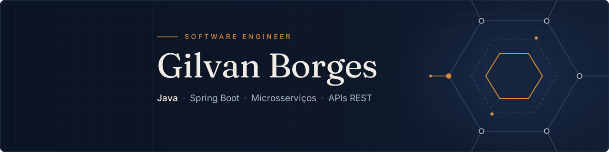

<div align="center">

[](https://www.linkedin.com/in/gilvanborges/)
[](https://gilvanborges.com.br/)
[](mailto:gilvan2022borges@gmail.com)

</div>

## Sobre mim

Passei anos na construção civil antes de escrever a primeira linha de código. Lá aprendi que obra boa começa na fundação, segue a planta e passa por inspeção antes de ser entregue. Levo isso para o software.

Desde jan/2025 sou desenvolvedor na **Vibetex**. Cuido de sistemas de ponta a ponta: do levantamento de requisitos à arquitetura, do deploy ao suporte em produção. Hoje me preparo para atuar como **arquiteto de software Java**.

```yaml
hoje:        Software Engineer · Vibetex
rumo_a:      Arquitetura de Software (DDD, hexagonal, sistemas distribuídos)
back_end:    Java 21 · Spring Boot · RabbitMQ · PostgreSQL · Flyway
qualidade:   JUnit 5 · Testcontainers · CI/CD com GitHub Actions
front_mobile: Angular · Flutter
formação:    ADS (UniFatecie) · Java WebDeveloper (COTI Informática)
```

## Projetos em destaque

| Projeto | O que mostra |
|---|---|
| [**apiSuporte**](https://github.com/FightConnect2025/apiSuporte) | Microsserviço de tickets e SLA. Java 21, Spring Boot, PostgreSQL, JWT. Publica eventos no RabbitMQ. |
| [**fightconnect-worker-notifications**](https://github.com/FightConnect2025/fightconnect-worker-notifications) | Worker assíncrono que consome o RabbitMQ e envia e-mail e push (Firebase), com ack manual, retry e DLQ. |
| [**formacao-coti**](https://github.com/gilvan-Borges/formacao-coti) | 4 APIs Spring Boot da formação COTI: JWT, MySQL, PostgreSQL, MongoDB e mensageria. |
| [**projeto-aspnet-aws**](https://github.com/gilvan-Borges/projeto-aspnet-aws) | API ASP.NET Core com cache em memória e pipeline na AWS. |
| [**kerodocerj**](https://github.com/gilvan-Borges/kerodocerj) | Landing page real de cliente, com deploy automático no GitHub Pages. |

## Stack

<div align="center">


<br>


<br>


</div>

## Estudando agora

Trilha rumo a arquiteto Java: **OCP Java SE 21**, *Effective Java*, Spring Boot por dentro e, na sequência, DDD e arquitetura hexagonal num repositório-vitrine com diagramas C4 e ADRs.

<div align="center">

<br>

[](https://git.io/streak-stats)

</div>
